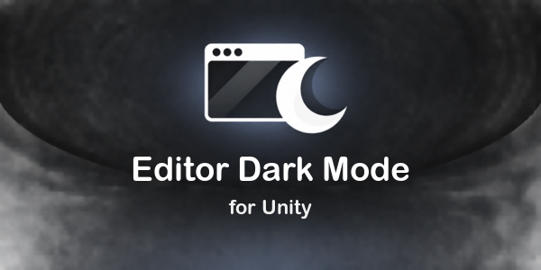

<p align="center">
  
</p>

# Editor Dark Mode for Unity

An unofficial UPM wrapper for
[Jiaqi Liu's Windows dark mode mod](https://github.com/0x7c13/UnityEditor-DarkMode).
It darkens the Unity Editor title bar, menu bar, and context menus on supported
Windows systems.

<p align="center">
  <a href="https://github.com/martincalander/UnityEditorDarkModeUPM/actions/workflows/ci.yml"></a>
  <a href="https://github.com/martincalander/UnityEditorDarkModeUPM/releases"></a>
  <a href="https://openupm.com/packages/com.martincalander.editordarkmode/"></a>
  
  <a href="LICENSE.md"></a>
</p>


## Requirements

| Dependency | Requirement |
| --- | --- |
| Operating system | Windows 10 version 1903 or newer, or Windows 11 |
| Architecture | x64 Unity Editor |
| Unity | 2021.3.37f1 or newer |

The package can be resolved on macOS and Linux, but its native plugin is
excluded there and provides no dark-mode functionality. Close and reopen the
Unity Editor after installing, updating, or removing the package. The native
DLL is preloaded only when the Editor starts.

## Installation

| Method | Best for | Integrity model |
| --- | --- | --- |
| [Unity bootstrap `.unitypackage`](#unity-bootstrap-installer) | Familiar Unity asset import | Checksummed bootstrap that installs the signed OpenUPM package |
| [OpenUPM](#openupm-recommended) | Normal installation and updates | Signed UPM archive |
| [GitHub Release `.tgz`](#signed-github-release-tarball) | Manual or offline installation | Signed UPM archive plus release checksum |
| [Pinned Git URL](#pinned-git-url) | Direct source installation | Version-pinned tag, but no UPM package signature |
| [Local folder](Documentation~/installation.md#local-folder-for-development) | Package development | Local files, but no UPM package signature |

### Unity Bootstrap Installer

Download
[`EditorDarkModeInstaller-1.1.1.unitypackage`](https://github.com/martincalander/UnityEditorDarkModeUPM/releases/download/v1.1.1/EditorDarkModeInstaller-1.1.1.unitypackage)
from the [`v1.1.1` release](https://github.com/martincalander/UnityEditorDarkModeUPM/releases/tag/v1.1.1),
then import it with **Assets > Import Package > Custom Package**.

The `.unitypackage` is a checksummed bootstrap, not a signed UPM archive. It
shows its installation plan before contacting OpenUPM, installs the exact
signed `1.1.1` registry package, verifies the installed version and source,
then removes its own bootstrap assets. Restart the Editor after it succeeds.
The bootstrap installs only from a supported Windows x64 Editor. It imports and
compiles on macOS and Linux but refuses to change the project there.

### OpenUPM (Recommended)

View package details on the
[Editor Dark Mode OpenUPM page](https://openupm.com/packages/com.martincalander.editordarkmode/).
From the Unity project root, run:

```bash
openupm add com.martincalander.editordarkmode
```

The [installation guide](Documentation~/installation.md#openupm-recommended)
also documents manual scoped-registry setup without the OpenUPM CLI.

### Signed GitHub Release Tarball

Download the
[signed `1.1.1` `.tgz`](https://github.com/martincalander/UnityEditorDarkModeUPM/releases/download/v1.1.1/com.martincalander.editordarkmode-1.1.1.tgz),
open Unity's Package Manager, and choose
**+ > Install package from tarball**. Select the downloaded file and restart
the Editor after installation.

### Pinned Git URL

In Unity's Package Manager, choose **+ > Install package from git URL** and
enter:

```text
https://github.com/martincalander/UnityEditorDarkModeUPM.git#v1.1.1
```

The tag pins the package source to `1.1.1`. Git installations do not use the
signed release tarball. Omitting `#v1.1.1` follows the mutable `main` branch and
is intended only for development.

See the [complete installation guide](Documentation~/installation.md) for
manual registry configuration, checksum verification, upgrades, removal, and
troubleshooting.

## Trust and Provenance

The bundled `UnityEditorDarkMode.dll` is Jiaqi Liu's unmodified x64 DLL from
the original
[`v1.1` release](https://github.com/0x7c13/UnityEditor-DarkMode/releases/tag/v1.1):

```text
SHA-256 745ddf984b84b98fd1915e64b94ef480367867de4b6363e0b4abb238b523f6b7
```

The signed UPM `.tgz` contains Unity's package attestation, which protects the
published package payload and lets compatible Unity versions verify that it
was not changed in transit. It does not make the package a Unity QA
"Verified" package, and it does not Authenticode-sign the native DLL. The DLL
itself is unsigned native code that is preloaded into the Windows Unity Editor.
Review the upstream source and provenance before installing it in a sensitive
environment.

## Authors and Licenses

[Jiaqi Liu (@0x7c13)](https://github.com/0x7c13) created the original extension
and built the DLL. Martin Calander maintains this UPM wrapper and its release
automation. See [AUTHORS.md](AUTHORS.md) and [NOTICE.md](NOTICE.md) for the exact
roles and provenance.

The original release is also available from the
[Unity Asset Store](https://assetstore.unity.com/packages/tools/gui/darkmode-for-unity-editor-on-windows-281842).
Jiaqi's copyright and MIT license are preserved in [LICENSE.md](LICENSE.md).
Notices for ReaperThemeHackDll and inipp are preserved in
[THIRD-PARTY-NOTICES.md](THIRD-PARTY-NOTICES.md).

Editor Dark Mode is not sponsored by or affiliated with Unity Technologies or
its affiliates. Unity and the Unity logo are trademarks or registered
trademarks of Unity Technologies or its affiliates in the United States and
elsewhere.
