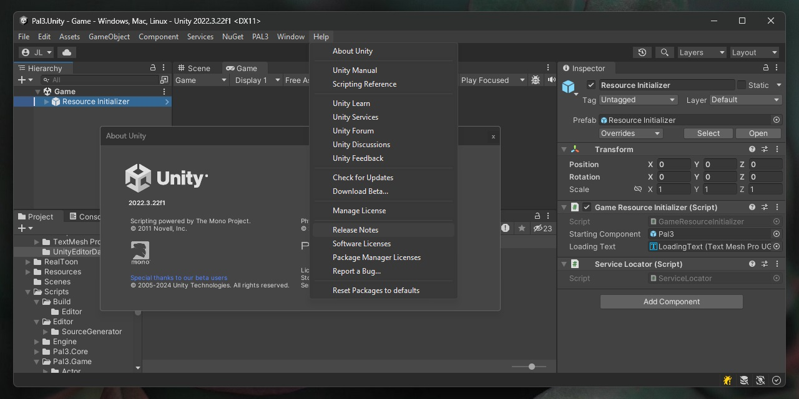

# Editor Dark Mode for Unity

This is Jiaqi Liu's Windows dark mode mod wrapped as a UPM package. It darkens
the Unity Editor title bar, menu bar and context menus.

You'll need Windows 10 version 1903 or newer, or Windows 11. The package
requires Unity 2021.3.37f1 or newer. Close and reopen the Editor after
installing it so the DLL can load.



## Install

In Unity, open **Window > Package Manager**, select
**+ > Install package from Git URL**, then paste:

```text
https://github.com/martincalander/UnityEditorDarkModeUPM.git
```

## Credit

[Jiaqi Liu (@0x7c13)](https://github.com/0x7c13) created the
[original project](https://github.com/0x7c13/UnityEditor-DarkMode) and built the
DLL included here. I maintain the UPM wrapper and its package metadata. The
DLL is included unchanged from his v1.1 release.

The original release is also available on the
[Unity Asset Store](https://assetstore.unity.com/packages/tools/gui/darkmode-for-unity-editor-on-windows-281842).

Jiaqi's copyright and MIT license are in [LICENSE.md](LICENSE.md). The DLL also
contains code from
[ReaperThemeHackDll](https://github.com/jjYBdx4IL/ReaperThemeHackDll) and
[inipp](https://github.com/mcmtroffaes/inipp). Their license notices are in
[THIRD-PARTY-NOTICES.md](THIRD-PARTY-NOTICES.md).
